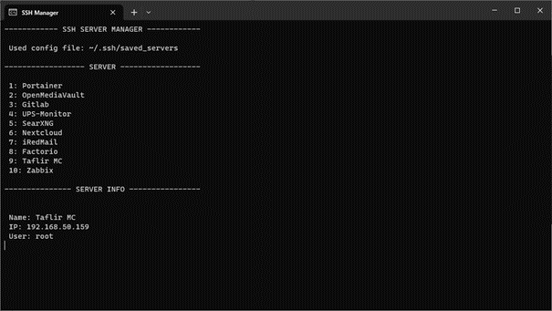

# SSH Manager

A tool for managing connections via ssh and sftp to your servers.

## Installation

If you are planing to utilize the SFTP features provided by the utility you need to place a WinSCP binary in the installation folder of this utility.

* Open you browser and navigate to the [WinSCP download page](https://winscp.net/eng/downloads.php).
* Scroll down until you see the "Portable executables" download button and clock on it.
* After some seconds a ZIP file should be downloaded. 
* Extract the WinSCP binary from that ZIP folder to the installation folder of this utility.

You are now ready to use the SFTP features of this utility.

## Why?

I used Putty for managing my servers since I started working with servers. As I got more and more into the linux, I learned the power of just a keyboard and how it can boost productivity. With Putty I had to use my mouse to connect to servers. So I created this tool to easily connect to my server trough a CLI tool. 
There was yet another reason for me to create this tool. I currently have about 12 VM running on my various servers. To keep all of these up to date, I had to connect to each and every one and check for updates. So the feature cluster command was created. With this I can connect to all my servers and updated them without connecting to every machine and updating it manually.

## I'm missing a feature

If your missing anything in this tool, that would be beneficial to your workflow. Please create a issue, so I can add it to the tool asap

## My private key is not found

- If your SSH private key is not in your current users home folder under `.ssh/id_rsa.ppk`, you can change this on line 13 in the file ending in `.js`. 
- If you don't have your private key available in the ppk file format, you can convert to it using a putty utility tool. Just search for a tutorial on the internet.