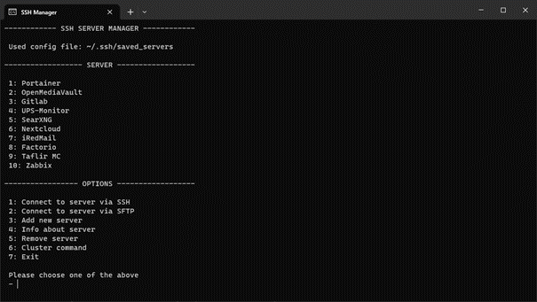

# SSH Manager

A tool for managing connections via ssh to your servers.

## Why?

I used Putty for managing my servers since I can remember. But as I got more and more into the linux, I learned the power of just a keyboard and how it can boot productivity. With Putty I had to use my mouse to connect to servers. So I created this tool to easily connect to my server trough a cli tool. 
There was yet another reason for me to create this tool. I currently have about 12 VM running on my server. To keep all of these up to date, I had to connect to each and every one and check for updates. So the feature cluster command was created. With this I can connect to all my servers and updated them without connecting to every machine and updating it manually.

## How?

I wanted to create a easily installable tool, so I only used packages that are pre installed with nodejs and npm. 

## I'm missing a feature

If your missing anything in this tool, that would be beneficial to your workflow. Please create a issue, so I can add it to the tool asap